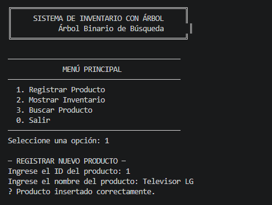
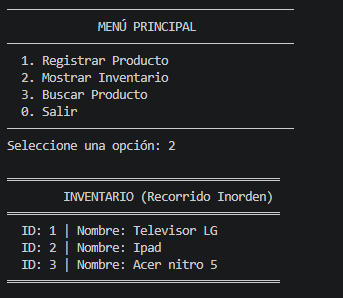
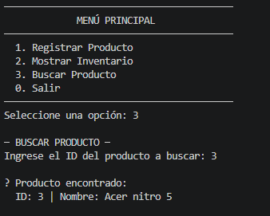

# 🌳 Sistema de Inventario con Árbol Binario de Búsqueda

## 📋 Objetivo

Desarrollar una aplicación de consola que gestione un inventario de productos mediante un **Árbol Binario de Búsqueda (BST)**. El sistema permite registrar productos, visualizar el inventario ordenado y buscar productos específicos de forma eficiente.


## 🚀 Instrucciones de Ejecución

### Requisitos
- **Java Development Kit (JDK)**: Eclipse Temurin 21 o superior
- **Sistema Operativo**: Windows, Linux o macOS
- **IDE**: VS Code (opcional)

### Pasos para Compilar y Ejecutar

#### Opción 1: Terminal / Símbolo del Sistema

```bash
# 1. Navegar al directorio del proyecto
cd d:\Users\User\Desktop\Tree-Stock

# 2. Compilar los archivos Java
javac src\Producto.java src\ArbolInventario.java src\Main.java

# 3. Ejecutar la aplicación
java -cp src Main
```

#### Opción 2: VS Code con Extensiones

1. Instalar la extensión "Extension Pack for Java"
2. Abrir la carpeta del proyecto en VS Code
3. Click derecho en `Main.java` → "Run"

#### Opción 3: IDE (Eclipse, IntelliJ)

1. Crear un nuevo proyecto Java
2. Copiar los archivos `.java` a la carpeta `src`
3. Ejecutar como Java Application


## 🎥 Capturas de Pantalla

### 1. Registro de Productos
()

### 2. Mostrar Inventario
()

### 3. Buscar Producto
()


